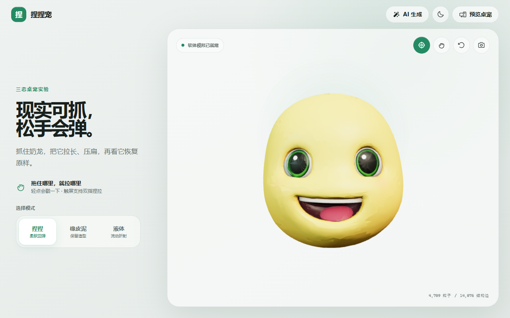
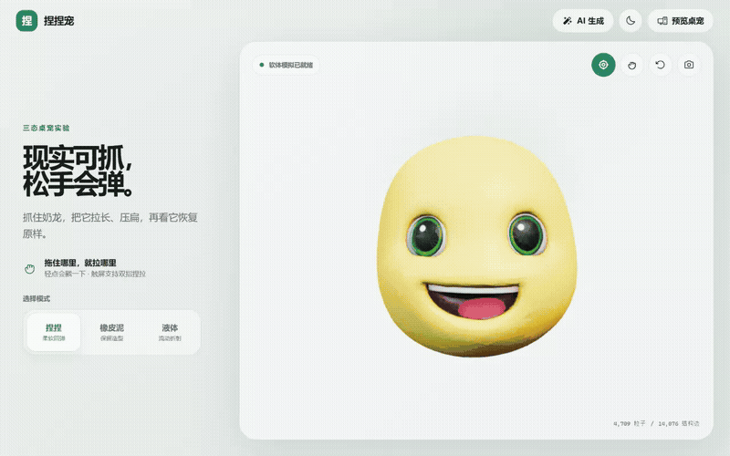
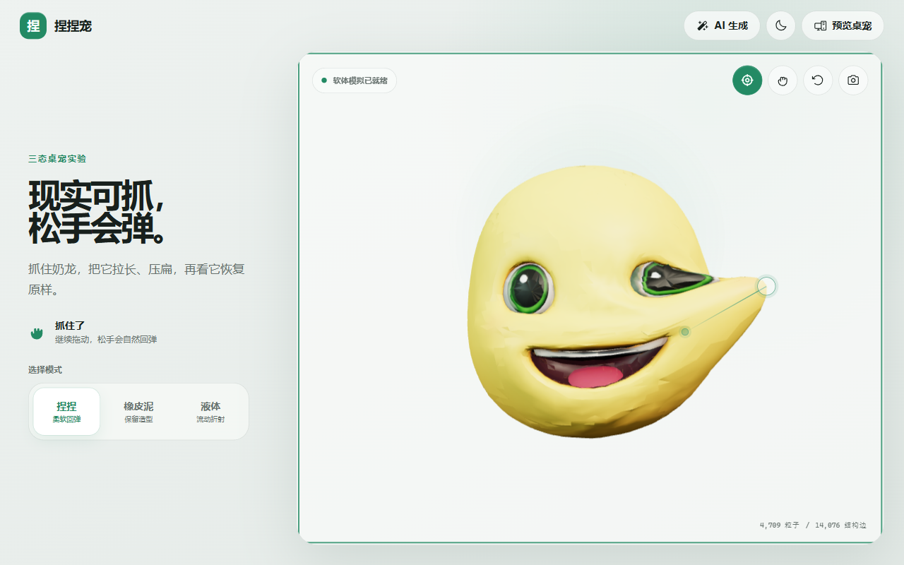
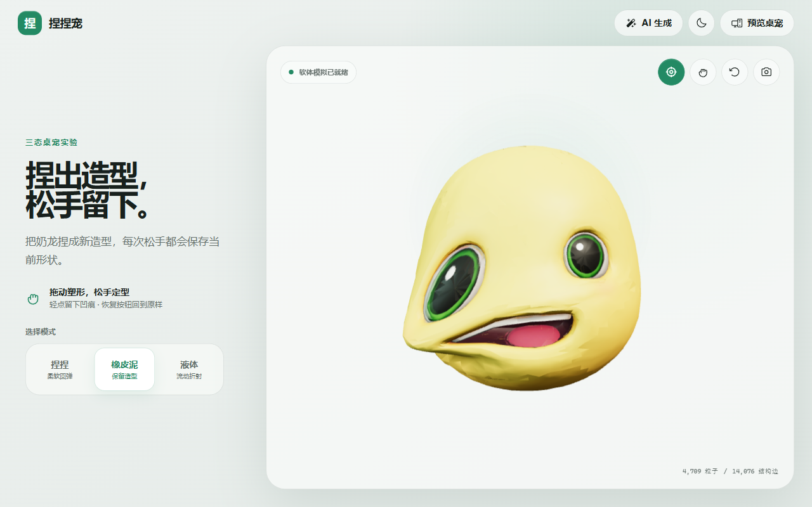
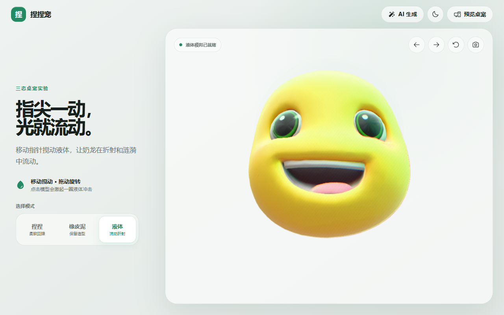
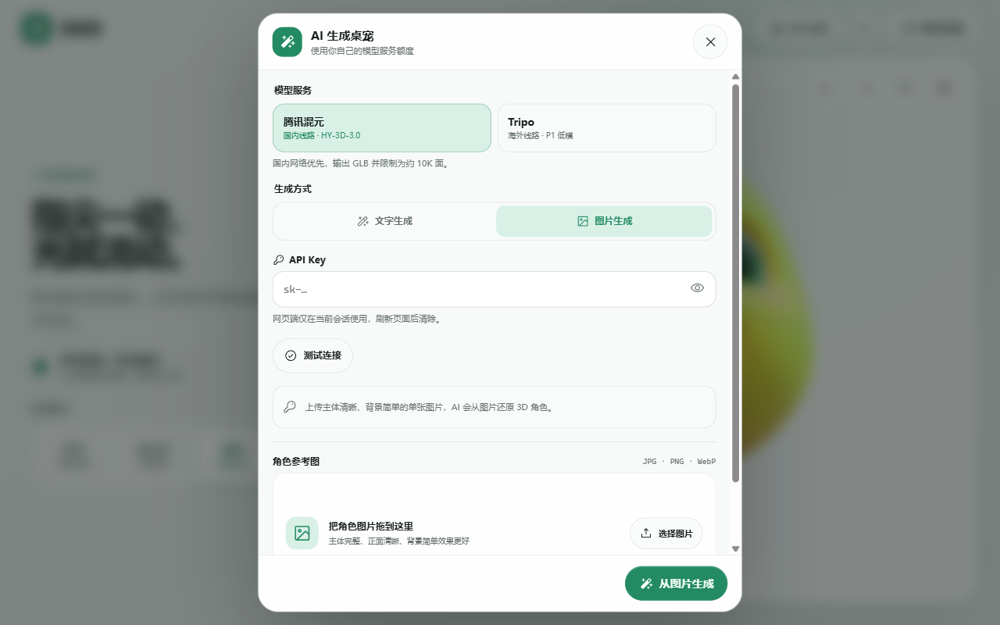

<p align="center">
  
</p>

<h1 align="center">捏捏宠 · Nienie Pet</h1>

<p align="center">
  一个能抓、能捏、会流动的 3D 网页实验与透明桌宠。
</p>

<p align="center">
  
  
  
  
  
</p>



## 项目简介

捏捏宠把同一个 GLB 角色放进三套实时交互系统：软体回弹、橡皮泥定型和液体折射。它既可以作为浏览器里的 3D 互动实验运行，也可以通过 Electron 变成置顶、透明、可穿透鼠标的 Windows 桌宠。

项目还内置 BYOK（Bring Your Own Key）模型生成入口，支持腾讯混元与 Tripo 的文生 3D、图生 3D，生成完成后会直接替换当前角色并进入三种互动模式。

## 效果演示

<p align="center">
  
</p>

<p align="center">
  <a href="./docs/media/demo.mp4">下载高清 MP4 演示录屏</a>
</p>

<table>
  <tr>
    <th width="33%">捏捏 · 柔软回弹</th>
    <th width="33%">橡皮泥 · 保留造型</th>
    <th width="33%">液体 · 流动折射</th>
  </tr>
  <tr>
    <td></td>
    <td></td>
    <td></td>
  </tr>
  <tr>
    <td>抓取局部网格并显示抓点与牵引线；松手后自然恢复。</td>
    <td>沿用软体手感，但会把松手时的形状烘焙为新静止形态。</td>
    <td>移动指针扰动流体，点击产生冲击，拖动旋转模型。</td>
  </tr>
</table>

## 主要能力

| 模块 | 能力 |
| --- | --- |
| 软体交互 | 射线拾取、局部抓取、XPBD 风格约束、回弹与点击凹陷 |
| 橡皮泥 | 拖拽塑形、松手定型、一键恢复 |
| 液体效果 | 折射、色差、涡流、颗粒、晃动、点击冲击与轨道旋转 |
| 交互反馈 | 可开关的抓点圆环与牵引方向线、状态提示、键盘与触控操作 |
| 网页工作台 | 三模式切换、深浅主题、截图保存、响应式布局 |
| Electron 桌宠 | 无边框透明窗口、置顶、托盘、隐藏、鼠标穿透、快捷键唤回 |
| AI 生成 | 腾讯混元 / Tripo，文字或单图生成约 10K 面 GLB |
| BYOK 安全 | 桌面端使用系统加密存储；网页端不持久化 API Key |

## AI 生成桌宠



点击页面或桌宠顶部的魔法棒按钮即可选择：

- **腾讯混元 TokenHub**：默认国内线路，模型为 `HY-3D-3.0`。
- **Tripo**：可选海外线路，模型为 `P1-20260311`。
- **文字生成**：输入 2–500 个字符的角色描述。
- **图片生成**：拖入或选择 JPG、PNG、WebP；宽高 128–5000 px，建议至少 256 px。

腾讯混元图片上限为 6 MB；Tripo 图片上限为 10 MB。图生模式不会把图片写入仓库或凭据文件：腾讯混元接收 Base64，Tripo 先通过官方上传接口换取临时图片凭证，再提交 `image_to_model` 任务。

### API Key 如何保存

- **Electron**：请求在主进程执行，Key 使用 `safeStorage` 调用 Windows 系统加密后写入应用数据目录；渲染进程无法读取已保存的明文。
- **网页**：Key 仅随当前会话请求发送给本地同源 Node 代理，不写入浏览器存储，也不会被代理持久化。
- **费用**：调用费用和额度由用户填写的模型服务账户承担。

## 灵感与技术来源

### 万梗捏

项目的核心交互灵感来自哔哩哔哩的 [万梗捏](https://www.bilibili.com/toy/MemeMash/index.html)：用户可以直接抓住 3D 角色局部并制造夸张、富有弹性的变形。捏捏宠围绕这一体验独立实现了 Three.js 射线拾取、软体约束、抓取反馈、橡皮泥定型和桌宠形态，未复制其业务源码。

### Canvas UI LiquidObject

液体模式基于 [Canvas UI `LiquidObject`](https://canvasui.dev/docs/components/liquid-object) React registry 组件进行集成和适配，并补充了模型加载、触控旋转、方向按钮、状态同步及本项目的响应式外壳。具体来源与许可条件见 [THIRD_PARTY_NOTICES.md](./THIRD_PARTY_NOTICES.md)。

### 奶龙演示素材

README 截图和录屏展示了本地调试时使用的奶龙模型。奶龙相关模型与图标不属于本项目，权利归相应权利人所有；仓库通过 `.gitignore` 排除 `public/assets/nailong.glb` 与 `public/icon.png`，不会分发素材本体，也不授予任何素材使用权。运行或发布项目时，请使用自行拥有版权或已获得正式授权的资源。

## 快速开始

### 环境要求

- Node.js 20.19+ 或 22.12+
- npm
- 支持 WebGL 的现代浏览器与显卡环境
- Windows 10/11（透明桌宠模式）

### 1. 克隆与安装

```bash
git clone https://github.com/USER-HFC/nienie-pet.git
cd nienie-pet
npm install
```

### 2. 准备角色资源

仓库不包含奶龙素材。请把你有权使用的 GLB 模型和托盘 PNG 图标放到以下位置：

```text
public/
├── assets/
│   └── nailong.glb
└── icon.png
```

支持的默认模型格式为 GLB。软体系统会选择模型中顶点数最多的 Mesh 作为可变形主体；为了获得更自然的效果，建议使用拓扑连续、尺度正常、正面朝向 `+Z` 的三角网格。

如需改用其他文件名，请同步修改 `src/App.tsx` 的默认模型地址和 `electron/main.mjs` 的托盘图标地址。

### 3. 启动网页

```bash
npm run dev
```

打开 `http://127.0.0.1:5173/`。该命令会同时启动 Vite 和本地 AI API 代理。

### 4. 启动透明桌宠

```bash
npm run desktop:dev
```

## 可用命令

| 命令 | 用途 |
| --- | --- |
| `npm run dev` | 启动 Vite 与网页 AI API 代理 |
| `npm run desktop:dev` | 启动 Vite 与 Electron 桌宠 |
| `npm run typecheck` | 执行 TypeScript 类型检查 |
| `npm run build` | 类型检查并生成生产构建 |
| `npm run desktop` | 构建后启动 Electron 桌宠 |
| `npm run web` | 构建后启动网页生产服务 |
| `npm run web:server` | 使用现有 `dist` 启动网页生产服务 |

## 桌宠操作

- 拖动窗口顶部区域移动桌宠。
- 点击图钉切换窗口置顶。
- 点击隐藏按钮或托盘菜单隐藏桌宠。
- 在托盘菜单中启用鼠标穿透。
- 按 `Ctrl/Cmd + Alt + N` 显示或隐藏窗口。
- 窗口失去焦点时，上下操作菜单会完全隐藏。

## 技术实现

```text
React UI
├── ModelViewport ── PetScene ── SoftBodySolver
├── LiquidViewport ── Canvas UI LiquidObject
└── AiModelDialog
    ├── Electron preload / IPC ── safeStorage + net.fetch
    └── Web same-origin proxy ── Tencent / Tripo adapters
```

- **渲染**：Three.js + WebGL，ACES Filmic tone mapping。
- **变形**：从 GLB 主网格构建粒子、结构边和弯曲约束，逐帧回写顶点。
- **抓取**：射线检测定位三角面，以相机平面映射指针位移。
- **液体**：后处理着色器完成折射、涡流、色差和扰动。
- **生成模型**：统一供应商适配层负责提交、轮询、GLB 下载与格式校验。
- **本地模型协议**：Electron 使用受限的 `nienie-model://` 协议加载持久化生成结果。

## 项目结构

```text
nienie-pet/
├── docs/media/                  # README 截图与演示录屏
├── electron/                    # Electron 主进程与预加载桥接
├── public/                      # favicon；本地角色资源由使用者自行准备
├── server/                      # 网页静态服务与无状态 AI API 代理
├── shared/                      # 腾讯混元 / Tripo 适配与 GLB 校验
├── src/
│   ├── ai/                      # Web / Electron 统一调用客户端
│   ├── components/              # 网页、桌宠、液体与 AI 对话框
│   ├── three/                   # 场景与软体求解器
│   ├── App.tsx
│   └── styles.css
├── THIRD_PARTY_NOTICES.md
└── vite.config.ts
```

## 已知限制

- 仓库不分发默认角色与托盘素材，首次运行前必须自行准备。
- 当前软体变形只作用于 GLB 中顶点数最多的 Mesh；多主体或蒙皮动画模型需要额外适配。
- AI 生成依赖第三方服务可用性、账户额度与用户所在网络。
- 网页 AI 代理默认只监听本机地址，不是面向公网部署的多租户服务。

## 许可证与第三方声明

本仓库目前未附加项目级开源许可证。除第三方组件各自许可范围外，未经许可不代表授予复制、修改或分发本项目代码及演示素材的权利。

Canvas UI 组件的版权、许可条件和 Commons Clause 限制见 [THIRD_PARTY_NOTICES.md](./THIRD_PARTY_NOTICES.md)。
